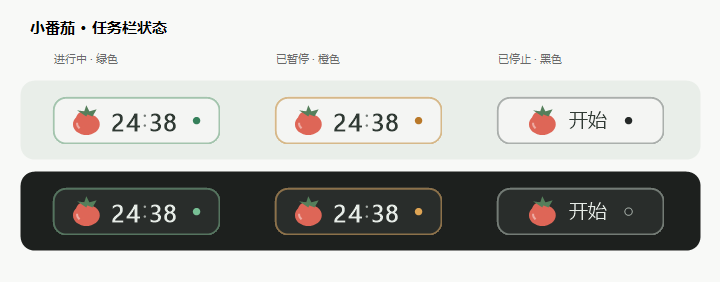
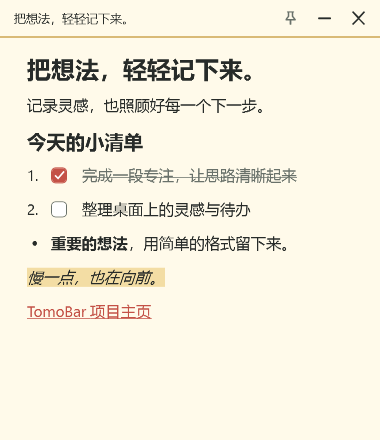
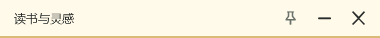
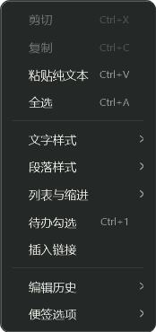
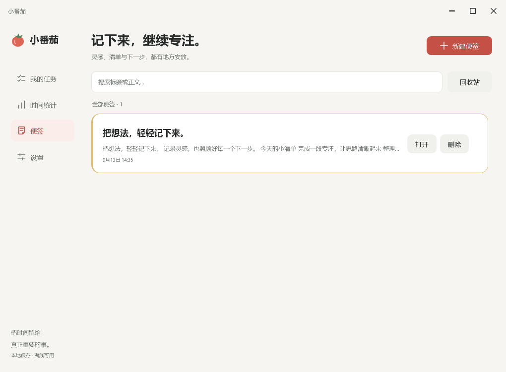
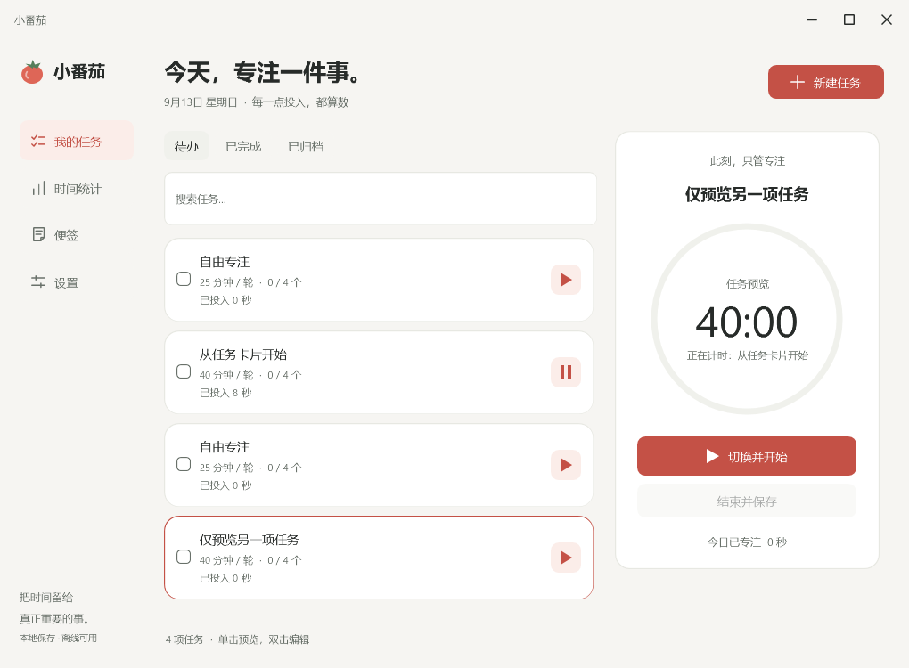
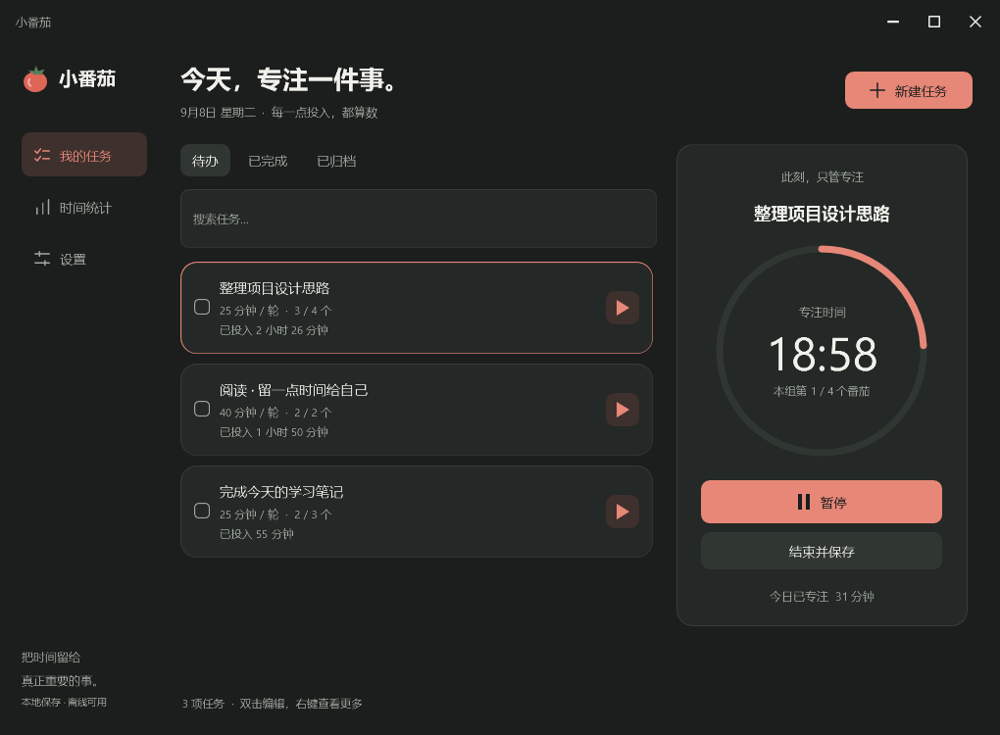

# TomoBar · 小番茄

轻量、中文原生的 Windows 11 任务番茄钟。把倒计时留在任务栏，把注意力留给手上的事。

[下载最新版](https://github.com/Claradoll/TomoBar/releases/latest) · [使用说明](docs/USER_GUIDE.md) · [更新记录](CHANGELOG.md)



## 开始使用

下载 Release 中的 `TomoBar-1.5.4-win-x64.zip`，解压后运行 `小番茄.exe`。也可直接下载单文件 `TomoBar.exe`。无需安装、账号、联网或管理员权限。

点击「开始专注」即可开始；没有任务时自动创建「自由专注」。主界面会自动收起，计时条继续在任务栏显示。

| 操作 | 行为 |
| --- | --- |
| 单击任务栏计时条 | 开始、暂停或继续 |
| 双击计时条 | 打开主界面，不改变计时状态 |
| 中键单击计时条 | 跳过当前短／长休息，专注与停止时不触发 |
| 右键计时条 | 主界面、便签、位置、设置、退出；再左键单击收起菜单 |
| 悬停计时条 | 查看任务名与状态 |
| Ctrl + Alt + P | 开始、暂停或继续 |
| Ctrl + Alt + O | 打开主界面 |
| Ctrl + Alt + N | 新建便签，可在设置更改或关闭 |

红色番茄与圆角矩形保持简洁；绿色表示进行中、橙色表示暂停、黑色表示停止。位置可在设置中调整，解锁后可横向拖动。

## 功能

- 富文本便签：标题、加粗、斜体、下划线、删除线、高亮、分点／编号列表和待办勾选；支持自动保存、独立置顶、搜索、回收站、关联任务与转为任务。
- 任务清单：单击预览时长，点击开始才切换计时；支持独立时长、预计番茄数、完成、归档和历史记录。
- 时间统计：实际专注时长、每日与任务累计、最近七天趋势、CSV 导出。
- 默认 25 分钟专注、5 分钟短休息，每四轮 15 分钟长休息，均可调整。
- 开机自启：默认关闭，开启后登录 Windows 在后台启动。
- 浅色、深色及跟随系统主题；矢量界面图标与等宽倒计时数字。
- 本地自动保存、上一份备份、手动备份恢复，暂停与休息不计入专注时间。

## 便签

在主界面「便签」页或任务栏右键菜单创建便签。直接输入正文；在主界面单击便签标题即可编辑，Enter 或点击别处保存，Esc 取消。标题会同步显示在便签顶部。关闭窗口前会自动保存。便签采用整张纸色背景。右键菜单将文字样式、段落样式、列表与缩进分别归组；颜色、置顶与任务关联集中在「便签选项」。编号／分点列表可叠加「待办勾选」，也可用 Ctrl+1 切换勾选框。勾选后文字变淡并加删除线，Ctrl+Z 可以撤销。



顶部图钉切换置顶，双击顶部可折叠／展开。折叠时只显示标题栏，拖到屏幕工作区边缘会自动贴边。









<details>
<summary>深色主界面</summary>


</details>

## 数据与升级

默认在 exe 旁的 `data` 文件夹保存数据；该目录不可写时使用 `%LOCALAPPDATA%\LittleTomato`。设置页可查看实际位置。

升级前从计时条或托盘菜单正常退出，只替换程序文件，保留 `data` 文件夹。再次启动时未结束的计时以暂停状态恢复，离线时间不计入专注。Release 中不包含示例或个人数据，截图使用测试样例。

## 运行环境

Windows 11 x64，使用系统自带的 .NET Framework 4.8 或更新版本。原生 WPF / WinForms，无浏览器内核或外部运行库；exe 约 230 KB。

计时条采用独立置顶窗口贴合主任务栏，不注入 Explorer。左对齐任务栏时放在上沿，避免遮挡开始按钮。全屏或任务栏自动隐藏时会暂时收起。

当前不含云同步、副屏选择、自动更新或代码签名。第三方任务栏修改工具和不同显示器组合尚未逐一验证；Windows 启动应用禁用选项可能覆盖应用内的自启登记。

## 构建与验证

在 Windows PowerShell 或 PowerShell 7 运行：

```powershell
.\build.ps1 -Test -Package
```

无需 NuGet、Node.js 或 .NET SDK。使用系统的 C# 编译器，产物位于 `dist`。GitHub Actions 在 Windows 上构建并运行核心测试，版本升级后发布 Release。

桌面 UI 集成检查需要真实 Windows 桌面和任务栏：

```powershell
Start-Process .\src\TomoBar\bin\LittleTomato.exe -ArgumentList '--data-dir', '"C:\Temp\TomoBar-ui-test"', '--background', '--ui-smoke' -Wait
```

`--ui-smoke` 会使用并改写指定的测试目录，务必使用独立空目录。不要使用真实数据目录。启动设置测试使用独立注册表测试键，结束后清理。

源文件说明与验证边界见 [开发说明](docs/DEVELOPMENT.md) 和 [验证记录](docs/VALIDATION.md)。
